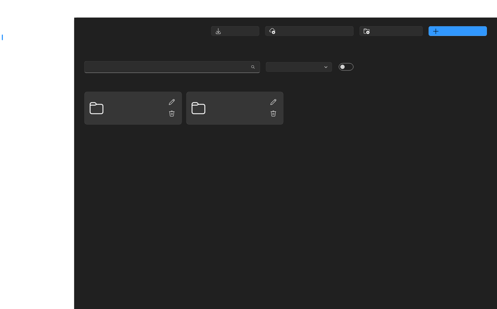
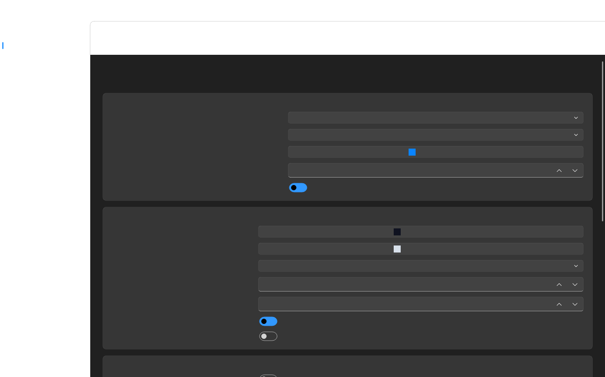

# NexTerm

NexTerm is a Windows SSH/SFTP desktop client built with PyQt5 and PyQt-Fluent-Widgets.

## Features



- SSH terminal with tabs, reconnect, snippets, mouse reporting and themed colors.
- Two-panel SFTP workspace with upload, download, rename, delete and drag-and-drop.
- Host groups with create, rename, delete and move-to-group actions.
- TCP tunnels through a VPS, including web and raw TCP traffic.
- Termius migration helper: imports exports, OpenSSH config and backs up the local Termius profile.
- Settings for theme, palette, opacity, autostart, notifications, sounds, Discord RPC and GitHub update checks.
- Standard and Enterprise licensing with server validation and offline grace.



## Run From Source

```powershell
py -m venv .venv
.venv\Scripts\activate
pip install -r requirements.txt
python main.py
```

## Build EXE

```powershell
powershell -ExecutionPolicy Bypass -File build.ps1
```

The EXE is created at:

```text
dist\NexTerm\NexTerm.exe
```

## License Server

NexTerm checks Enterprise activation files from:

```text
http://193.23.221.4/licenses/<ACTIVATION_CODE>.json
```

Generate 16 activation files:

```powershell
python tools\generate_licenses.py
```

Upload the generated `server/licenses` folder to the web root on `193.23.221.4`.

## Editions

Standard is the default local license. Enterprise unlocks commercial deployment status, priority update channel and longer offline grace.

See [LICENSE](LICENSE) and [ENTERPRISE_LICENSE.md](ENTERPRISE_LICENSE.md).
